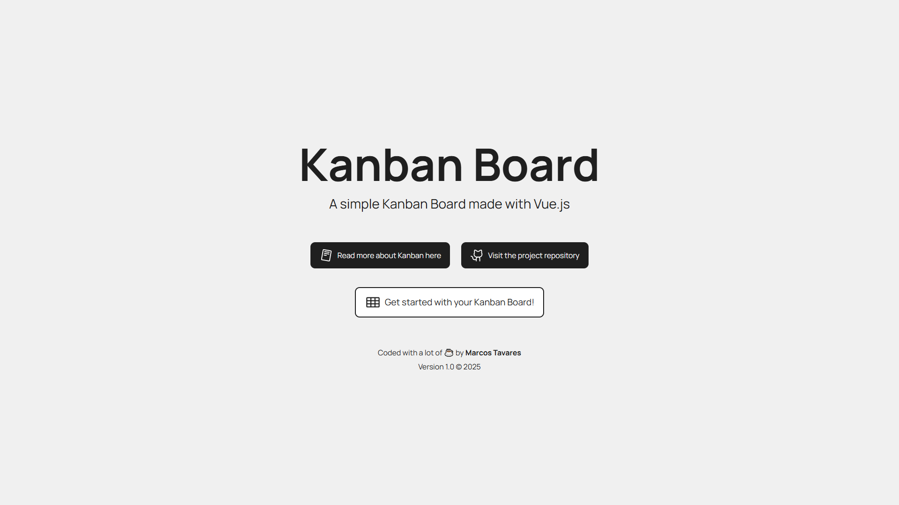
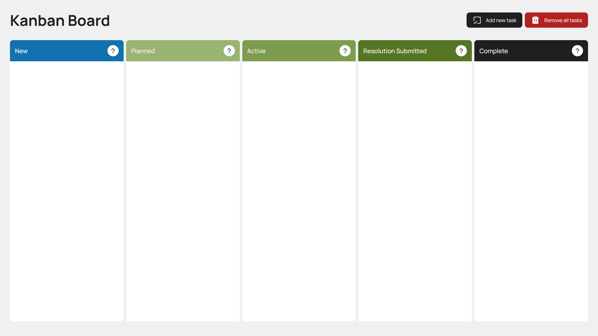

# 🎯 Kanban Board

A dynamic and responsive Kanban Board built with Vue 3, Pinia and Vue Router. You can craete, edit, drag and remove tasks — all with smooth animations and state persistence.

## ✅ Features

- Task creation with automatic timestamp
- The 'New' column, which represents the initial column, has a 6 tasks limit
- Smooth drag & drop between columns
- Inline title editing for the tasks
- Persistent state using `localStorage` (Pinia)
- Column descriptions via Tippy.js tooltips
- Optimized for laptop and desktop viewports

## 👀 Preview

<p align="center">
  
  
</p>

## 🌐 Deployment

This project was deployed using GitHub Pages with a CI/CD approach. The live production version of the application is available [here](https://mjtavrs.github.io/kanban-dashboard-vue/).

## ⚙️ Technologies used

- [Vue 3](https://vuejs.org/)
- [Pinia](https://pinia.vuejs.org/) + [Persisted State](https://prazdevs.github.io/pinia-plugin-persistedstate/)
- [Vue Router](https://router.vuejs.org/)
- [SortableJS](https://sortablejs.github.io/Sortable/)
- [Tippy.js](https://atomiks.github.io/tippyjs/)
- [Phosphor Icons](https://github.com/phosphor-icons/vue)
- [Vite](https://vite.dev/)

## 🏃 How to run this project locally

First, you have to clone this repository:

```bash
  git clone https://github.com/mjtavrs/kanban-dashboard-vue.git
```

Then, enter the project directory:

```bash
cd kanban-dashboard-vue
```

Install the dependencies:

```bash
npm install
```

Finally, start the development server:

```bash
npm run dev
```

## 📦 Build & Deploy

Begin by building for production:

```bash
  npm run build
```

After that, deploy it to GitHub Pages:

```bash
npm run deploy
```

## 🗂️ Project folder structure

```txt
kanban-dashboard/
├── App.vue
├── main.js
├── public/
└── src/
    ├── assets/
    │   └── style.css
    ├── components/
    │   ├── KanbanColumn.vue
    │   ├── KanbanPostIt.vue
    │   └── NewTaskModal.vue
    ├── router/
    │   └── index.js
    ├── store/
    │   └── kanban.js
    └── views/
        ├── BoardView.vue
        └── HomeView.vue
```

## ✏️ Author

- [@mjtavrs](https://www.github.com/mjtavrs)

## ⚖️ License & Copyright

This repository uses the [MIT](https://choosealicense.com/licenses/mit/) license, which allows commerical use, distribution, modification and private use.
